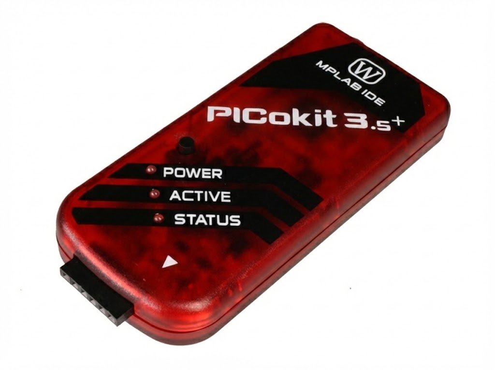
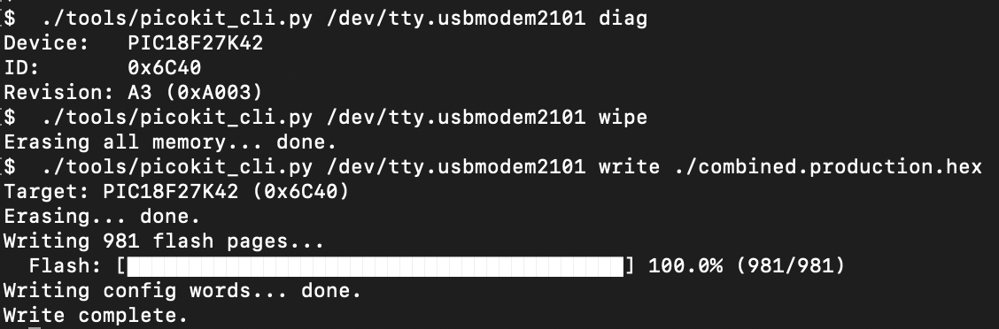

# PICokit

[](LICENSE)
[](#hardware-architecture)



ICSP programmer for PIC18FxxK42 microcontrollers using a Raspberry Pi Pico (RP2040). Tested on PIC18F27K42.




## Prerequisites

**LVP (Low-Voltage Programming) must be enabled** on the target PIC. This programmer uses Low-Voltage Programming mode (entry via MCLR toggling at VDD level). If LVP is disabled in the configuration bits, High-Voltage Programming (9V on MCLR) is required, which this programmer does not support.

## Wiring

```
Pico (RP2040)           PIC18 Target
─────────────           ────────────
GP29  (MCLR)  ────────  MCLR
GP7   (SPI TX/DAT) ───  ICSPDAT
GP6   (SPI CLK) ──────  ICSPCLK
GP4   (SPI RX) ───────  ICSPDAT (read)
GND   ─────────────────  VSS
3V3   ─────────────────  VDD
```

SPI0 is used in Mode 1 (CPOL=0, CPHA=1) at 5 MHz.
ICSPDAT is directly driven by the Pico SPI MOSI pin for writes;
for reads, the firmware temporarily switches to the MISO pin (GP4).

## Building the Firmware

Requires the [Pico SDK](https://github.com/raspberrypi/pico-sdk).

```bash
export PICO_SDK_PATH=/path/to/pico-sdk
mkdir -p build && cd build
cmake ..
make -j
```

Output: `build/picokit.uf2`

### Deploy

```bash
# Via picotool
picotool load -v -x build/picokit.uf2 -f

# Or copy picokit.uf2 to the Pico in BOOTSEL mode
```

## Host Tool

Requires Python 3.10+ with `pyserial` and `intelhex`:

```bash
pip install pyserial intelhex
```

### Commands

```bash
# Show firmware version
python3 tools/picokit_cli.py /dev/tty.usbmodem210 version

# Read device ID
python3 tools/picokit_cli.py /dev/tty.usbmodem210 diag

# Erase all memory
python3 tools/picokit_cli.py /dev/tty.usbmodem210 wipe

# Program a HEX file (erase + write flash/config/EEPROM)
python3 tools/picokit_cli.py /dev/tty.usbmodem210 write firmware.hex

# Verify programmed contents against HEX file
python3 tools/picokit_cli.py /dev/tty.usbmodem210 verify firmware.hex

# Dump flash to file
python3 tools/picokit_cli.py /dev/tty.usbmodem210 dump output.hex
python3 tools/picokit_cli.py /dev/tty.usbmodem210 dump output.bin --format bin --start 0x0 --size 0x20000

# Read and decode config bits
python3 tools/picokit_cli.py /dev/tty.usbmodem210 config

# EEPROM self-test
python3 tools/picokit_cli.py /dev/tty.usbmodem210 test_eeprom

# Release target
python3 tools/picokit_cli.py /dev/tty.usbmodem210 reset
```

## Serial Protocol

Binary frames over USB CDC at 115200 baud.

**Request:** `[CMD:1] [LEN:2 LE] [PAYLOAD:N] [CRC8:1]`
**Response:** `[STATUS:1] [LEN:2 LE] [PAYLOAD:N] [CRC8:1]`

CRC-8 polynomial: 0x07, init 0x00, computed over all bytes except the CRC itself.

| Cmd  | Name         | Request Payload        | Response Payload             |
|------|--------------|------------------------|------------------------------|
| 0x01 | DIAG         | —                      | dev_id(2), rev_id(2), name   |
| 0x02 | ERASE        | —                      | —                            |
| 0x03 | WRITE_PAGE   | addr(4), data(128)     | —                            |
| 0x04 | WRITE_CONFIG | addr(4), len(2), data  | —                            |
| 0x05 | WRITE_EEPROM | addr(4), len(2), data  | —                            |
| 0x06 | READ         | addr(4), len(2)        | data(N)                      |
| 0x07 | RESET_TARGET | —                      | —                            |
| 0x08 | TEST_EEPROM  | —                      | result(1)                    |
| 0x09 | VERSION      | —                      | version string               |

**Status:** 0x00=OK, 0x01=invalid cmd, 0x02=CRC error, 0x03=no target, 0x04=verify fail, 0x05=bad payload

## Supported Devices

Tested on **PIC18F27K42** only.

The ICSP protocol implemented follows the PIC18 K42-family command set (DS40001886B), which differs from the Q41/Q40 family. Other K42-family devices (PIC18F26K42, PIC18F25K42, PIC18F24K42, PIC18F47K42, etc.) should work but have not been tested. Q41/Q40 devices use a different protocol and are **not supported**.

## License

MIT
Copyright (c) 2026 Seclabz
